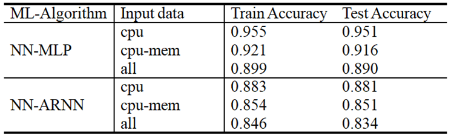

# IBN-Based Future Resource Prediction

### By Khan Talha Ahmed

The goal of using Machine Learning in this scenario is to predict the future resource utilization of VM¡¯s in the cloud environment. We have achieved high accuracy, where train accuracy is 95.3\% and test accuracy is 91.3\% using MLP neural network and we predicted the accuracy on 20 uniformly distributed classes with every bucket having 5\% of the utilization division.

# Description of Data

An OpenSource Dataset is used for this purpose. Dataset consists of three cloud datacenter traces where each trace contains data fron 530 VM on average over a time period of 3 months 

# Data Preprocessing/Filtering

We have performed aggregation and averaging on the dataset as dataset contains two many repetitive rows because data was collected after a very small period of time. The averaging window size was set to 9 seconds which equals 30 rows of the data. In the table we can see now of VM and avg no of rows for each VM in the trace.
![](pictures/table6 .png

# Formal Description

This project aimed at finding future utilization pattern of VM running in cloud using the current state of the VM

# Performance Evaluation and Results

The results of the training Model is as follows

